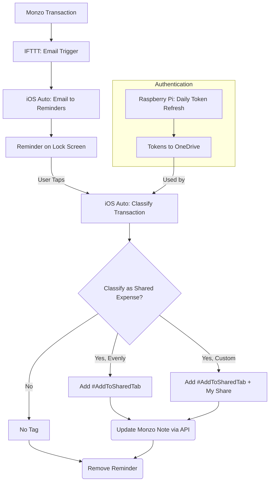
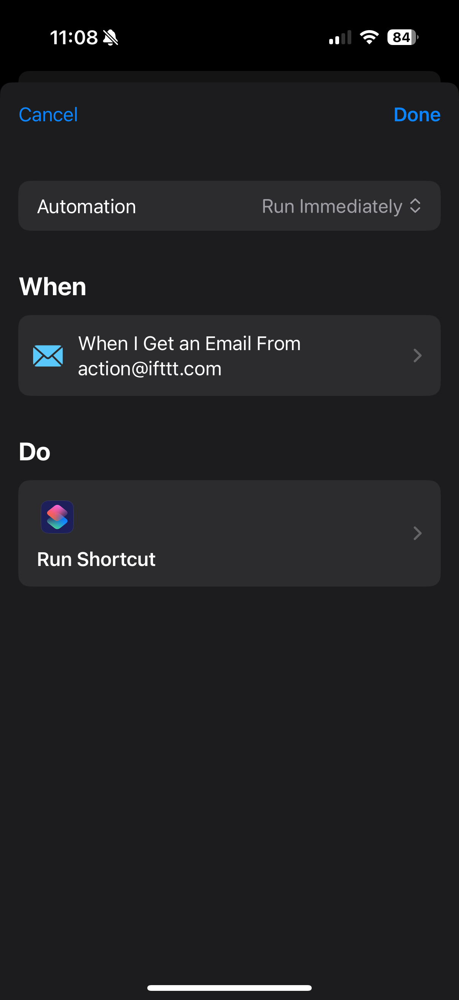
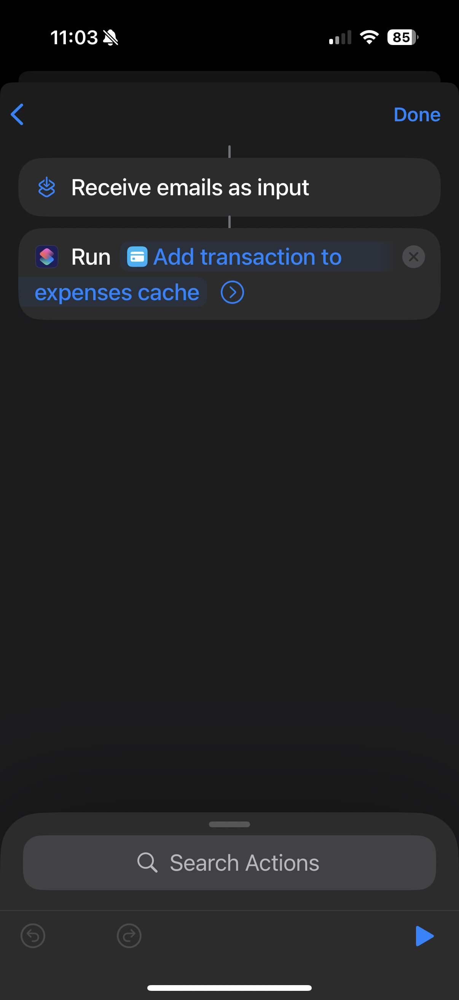
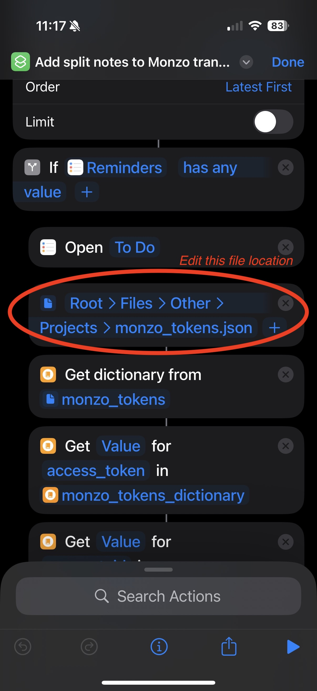
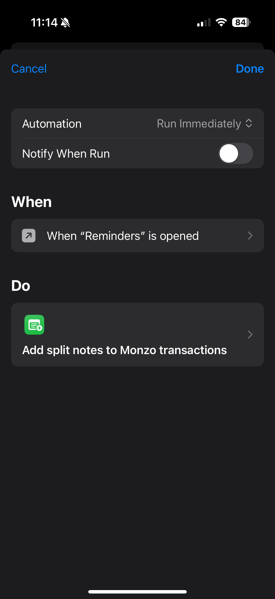
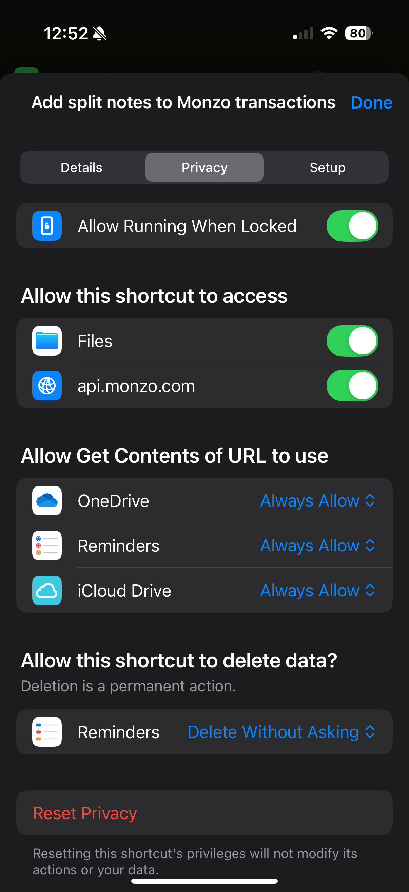

# 🏷️ Smart Monzo Transaction Tags (iOS Shortcuts & IFTTT)

<!--- Start of badges -->
<!-- Badges: python,shortcut,api,monzo,raspberrypi,ifttt -->

<p align="left">

 
 
 
 
 
</p>
<!--- End of badges -->

<!--- Blurb
Automate your Monzo spending! This project uses IFTTT and iOS Shortcuts to immediately prompt you to categorise transactions via an easy interface, adding smart, searchable tags for effortless shared expense tracking and personal categorisation.
-->

<!--- Start of Thumbnail-->
<!--- <div style="text-align:center;">
    
</div> -->
<!--- End of Thumbnail-->

<p align="center" width="50%">
    
</p>

This project is a smart automation I put together to help me keep on top of my Monzo transactions and categorise my spending, particularly for shared expenses. I built this as I often found it challenging to recall which payments needed to be added to a shared tab when reviewing my monthly spending.

Leveraging the Monzo API's ability to edit transaction notes, combined with IFTTT and iOS Shortcuts, this setup ensures every Monzo purchase triggers a persistent iPhone lock screen notification. That notification sticks around until you have classified the transaction, encouraging you to categorise things while they are still fresh in your memory. For shared expenses, I have set it up to simply add the `#AddToSharedTab` tag and, for uneven splits, my contribution (i.e., `me: £XX`). This is the best workaround, as the Monzo API doesn't let you directly add expenses to a shared tab - it only allows you to modify the notes. However, when you're later adding expenses to a shared tab, you can see these notes, making it very easy to spot all the transactions you have tagged.

And it's not just for those with shared tabs! This project is highly customisable. Anyone who wants to add quick, searchable tags or notes to their transactions as they happen can easily adapt this automation to suit their own needs. For example:

* **Categorisation Assistance:** Get prompted to add custom tags (like `#Groceries`, `#Transport`, or `#Entertainment`) to your transactions.
* **Budget Flagging:** Automatically flag transactions that go over a certain amount or fall into specific categories, prompting you to review them.
* **Business Expense Tagging:** Easily add tags like `#Business` or specific client/project codes to your transactions for easier reimbursements.

## Table of Contents

* [📋 Requirements](#-requirements)
* [🔧 How It Works](#-how-it-works)
* [🚀 Setup Instructions](#-setup-instructions)
    * [Authentication Script Setup](#authentication-script-setup)
    * [IFTTT Setup](#ifttt-setup)
    * [iOS Shortcuts Setup](#ios-shortcuts-setup)
    * [Email Configuration](#email-configuration)
* [🙏 Credits](#-credits)

## 📋 Requirements

* Monzo account
* IFTTT account
* iPhone/iOS device (with Shortcuts)
* Dedicated secondary email account for IFTTT triggers
* Monzo developer account (for API keys)
* Raspberry Pi (or an equivalent scheduled computing environment) for the daily token refresh

## 🔧 How It Works

The system operates by having IFTTT send an email to a dedicated address every time you spend with Monzo. An iOS automation then captures this email, extracts transaction details, and creates a reminder on your iPhone. When you tap this reminder, another iOS automation prompts you to classify the expense (e.g., whether it is a shared expense) and then uses the Monzo API to add a corresponding note to the transaction. A Python script on a Raspberry Pi ensures your Monzo API tokens stay refreshed and accessible.

<div style="width: 40%; max-width: 600px; margin: 0 auto; margin-bottom: 20px;">


</div>

## 🚀 Setup Instructions

### Authentication Script Setup
1.  **Monzo Developer Account:** [Register for a Monzo developer account](https://developers.monzo.com/). Once registered, navigate to the **Clients** section and select **New OAuth Client** to obtain your `CLIENT_ID` and `CLIENT_SECRET`.
    * Set the client's confidentiality to `Confidential`. This allows refresh tokens to be issued.
    * Set the redirect URL to `http://localhost:8000/callback`.
2.  **Prepare Your Raspberry Pi:**
    * Clone the [GitHub repository](https://github.com/isi22/Monzo-Apple-Shortcut):
        ```bash
        cd ~ # Navigate to where you want to store the project
        git clone [https://github.com/isi22/Monzo-Apple-Shortcut](https://github.com/isi22/Monzo-Apple-Shortcut)
        cd Monzo-Apple-Shortcut
        ```
    * Create a virtual environment and install Python dependencies:
        ```bash
        python3 -m venv .venv
        source .venv/bin/activate
        pip install -r requirements.txt
        ```

3.  **OneDrive Configuration:** This is how your Pi will store and retrieve Monzo tokens.
    * Install `rclone` and run its configuration wizard in your Raspberry Pi's terminal:
        ```bash
        sudo apt install rclone
        rclone config
        ```
    * Follow the prompts, answering as follows:
        * `n` for `New remote`.
        * Give it a **name** (e.g., `onedrive_tokens`).
        * Select `onedrive` from the list.
        * Leave `client_id` and `client_secret` **blank** (press Enter).
        * Choose your region (e.g. , `1` for `Global`).
        * Leave `Advanced config` blank (press Enter).
        * For `Use web browser to automatically...`, type `n` (No).
        * On a computer with a screen and web browser, run `rclone authorize "onedrive"` in the terminal.
        * Copy the generated text and paste it into your Raspberry Pi's terminal.
        * Select `onedrive` from the list.
4.  **Schedule Cron Jobs:**
    * Make the Python script executable:
        ```bash
        chmod +x authentication.py
        ```
    * Open the crontab scheduler (`crontab -e`) and add the following lines, making sure to replace the placeholder values (`"XX"` and `/Path/To/...`) with your actual information:
        ```bash
        # Environment variables
        MONZO_CLIENT_ID="XX" 
        MONZO_CLIENT_SECRET="XX"
        MONZO_TOKEN_FILE="onedrive:/Path/To/File/monzo_tokens.json"

        # m h dom mon dow command
        0 5 * * * /bin/bash -c "source /Path/To/ProjectFolder/.venv/bin/activate && /Path/To/ProjectFolder/authentication.py" >> /var/log/monzo_token_refresh.log 2>&1
        ```
        The cron job `0 5 * * *` executes the script daily at 5:00 AM.

5.  **Initial Authentication:** Run `authentication.py` on a computer with a screen and web browser for the first time. This step verifies your Monzo account by opening a browser window for authorisation. Follow the prompts to complete the process. The generated access tokens will be saved to your specified `MONZO_TOKEN_FILE` on OneDrive, and the Raspberry Pi will subsequently update this file daily with refreshed tokens via the scheduled cron job.


### IFTTT Setup
1.  **Create an IFTTT Account:** If you don't have one, sign up at [ifttt.com](https://ifttt.com/). Create this account using an email address that you don't mind receiving regular trigger emails to. Ideally, this should be an email address that can be set up on Apple Mail and is not your primary email, allowing you to easily filter it out from your main inbox.
2.  **Use the Provided Applet:** Access the pre-configured IFTTT applet directly via [https://ift.tt/dXMLPSx](https://ift.tt/dXMLPSx).
3.  **Connect Monzo and Configure Email:** When prompted, connect your Monzo account.
4.  **Enable Applet:** Enable the applet to activate the automation.

### iOS Shortcuts Setup
1.  **Create "Expenses Cache" Reminder List:** In the Apple Reminders app, create a new list named "Expenses Cache".
2.  **Set up Automation to Save Incoming Transactions:** This automation runs whenever an email is received from `action@ifttt.com`.

    <p align="center" width="100%">
    
    
    </p>
 
    * **Download the shared shortcut:** First, download the ["Add transaction to expenses cache"](https://www.icloud.com/shortcuts/81fdb99b8a434d569f3d4a1ce109e185) shortcut, which handles the parsing of the email subject line and adding the reminder to "Expenses Cache".
    * **Create New Automation:** Open the Shortcuts app on your iPhone. Tap the **"Automation"** tab at the bottom, then tap the **plus symbol (+)** in the top right corner.
    * **Set Trigger:** Choose "Email" as the trigger. In the next screen, tap "Sender" and enter `action@ifttt.com`. Ensure "Run Immediately" is selected to ensure a seamless background process.
    * **Configure Actions:** Select "New Blank Automation". Add a "Run Shortcut" action, and select the downloaded "Add transaction to expenses cache" shortcut. Ensure you pass the "Subject" from the "Shortcut Input" as input to this shortcut.


3.  **Set up Automation to Classify Saved Transactions:** This automation is triggered when "Reminders" is opened.
    <p align="center" width="100%">
    
    
    
    </p>

    * **Download the shared shortcut:** Download the ["Add split notes to Monzo transactions"](https://www.icloud.com/shortcuts/9a8250dfa1984c32add924d1d67ff507) shortcut. This shortcut fetches transaction notes from Monzo, prompts for shared expense classification, appends custom notes, and updates the transaction.
    * **Configure Shortcut for Monzo Tokens:** Ensure the shortcut is configured to read the `monzo_tokens` file from the OneDrive location, matching the path used by the `authentication.py` script.
    * **Create New Automation:** Create a new Automation.
    * **Set Trigger:** Choose "App" as the trigger, then select "Reminders" and set it to "Is Opened". Ensure that "Run Immediately" is selected.
    * **Configure Actions:** Select the downloaded "Add split notes to Monzo transactions" shortcut.
    * **Configure Privacy Settings:** Upon the shortcut's initial run, you'll be asked to grant specific access permissions (such as to the `monzo_tokens` file and the Monzo API). To confirm these settings are correct, open the shortcut within the Shortcuts app, tap the info icon (i) at the bottom of the screen, and then go to the `Privacy` tab. Ensure the privacy settings match those displayed in the image above. You may need to specifically allow the shortcut to delete reminders without asking for confirmation each time.

### Email Configuration
1.  **Add Email Account to iPhone:** Add the dedicated email address (where IFTTT sends emails) to your iPhone's Mail app.
2.  **Set Up Mail Filters/Rules:**
    * **iPhone Mailbox Filter:** On your iPhone, within the Mail app, navigate to `All Inboxes`. Tap the filter icon (three horizontal lines) in the bottom left corner. Edit the `Filtered by:` option to exclude mail from the dedicated IFTTT email account.
    * **Automated Read Rule:** Set up a rule in your email service (usually via a web browser or desktop application) to automatically mark all messages received from `action@ifttt.com` as read.

## 🙏 Credits

This project is powered by the **Monzo API**, **IFTTT**, and **Apple Shortcuts**.
